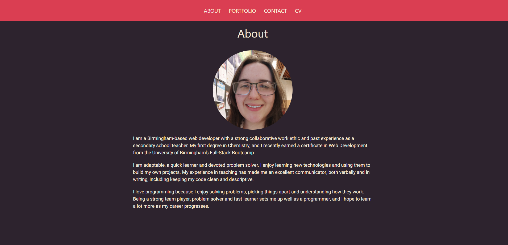
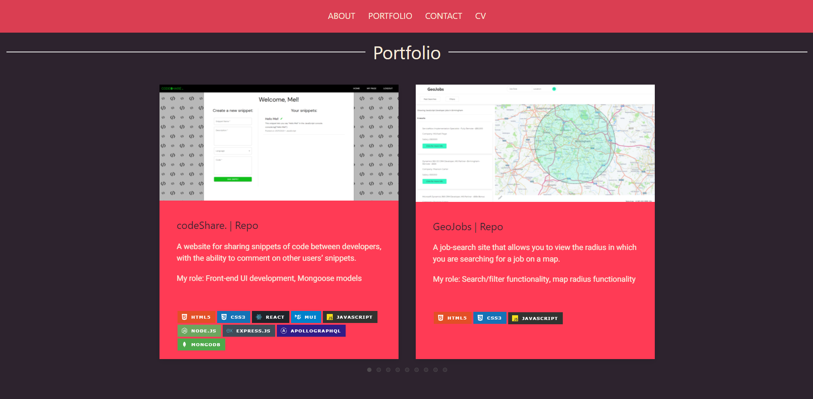
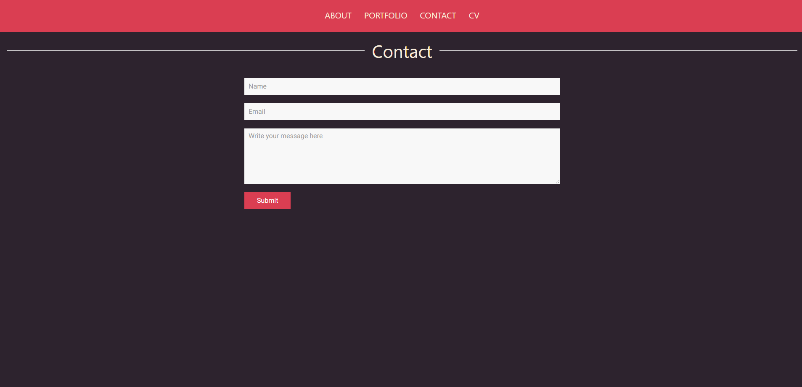

# portfolio [](https://opensource.org/licenses/MIT)

## Table of Contents
* [Description](#description)
* [Installation](#installation)
* [Usage](#usage)
* [License](#license)
* [Contact](#contact)

## Description
My personal portfolio of websites, built using React.js and UIKit. 

## Installation
Navigate to ```./portfolio```

Run the following command from the terminal: 

```npm i```

## Usage
The portfolio is deployed at [meljack1.github.io/portfolio](https://meljack1.github.io/portfolio). 

To run the application on a local server, follow the following steps: 

1. Navigate to ```./portfolio```

2. Open a new terminal and run the following command:

```npm start```

Screenshots:





## License 
This project is covered under the MIT License: [](https://opensource.org/licenses/MIT)

## Contact
Please feel free to contact me through GitHub or email, using the following details: 

Email: mel.jack.developer@gmail.com

GitHub: [meljack1](https://github.com/meljack1/)
